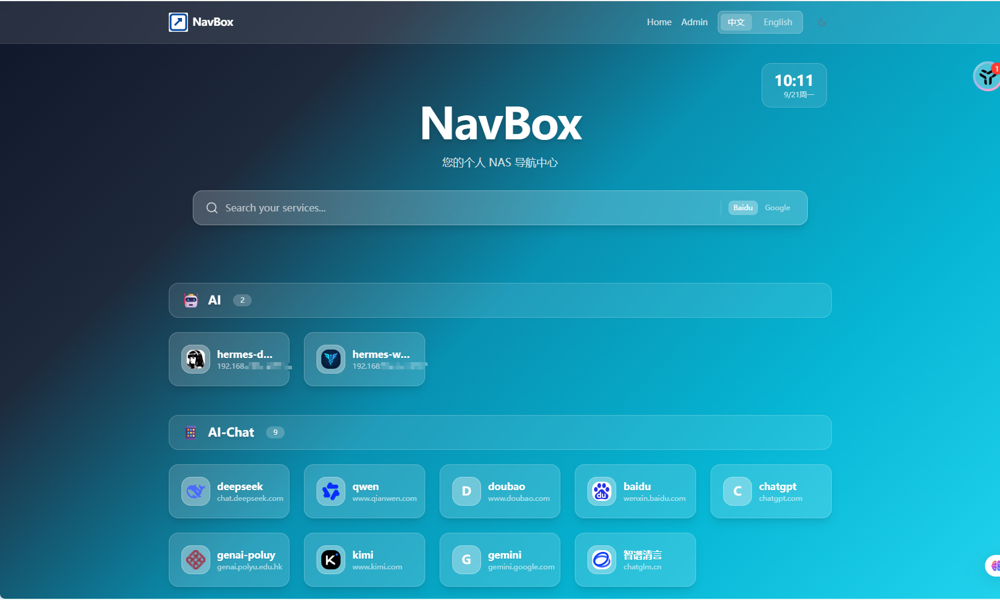

# NavBox

NavBox is a self-hosted NAS / private navigation hub inspired by OneNav. It is aimed at individuals and small teams who want to centralize and display frequently-used links and internal service entry points. Single-container Docker deployment, SQLite persistence, no external dependencies.

Stack: Next.js 14 (App Router) + TypeScript + Tailwind CSS + Prisma / SQLite.

[简体中文 README](README.md) · [English README](README.en.md)

## Screenshot



---

## Table of Contents

- [Screenshot](#screenshot)
- [Features](#features)
- [Quick start](#quick-start)
- [First run](#first-run)
- [Environment variables](#environment-variables)
- [Optional features](#optional-features)
  - [Enable Docker container scanning](#enable-docker-container-scanning)
  - [Enable Nginx site scanning](#enable-nginx-site-scanning)
- [Local development](#local-development)
- [Database migrations](#database-migrations)
- [Security notes](#security-notes)
- [Project structure](#project-structure)
- [FAQ](#faq)

---

## Features

- **Single admin**: the system supports exactly one admin account, created through the first-run wizard. Sessions are HttpOnly-cookie based.
- **Categories / links**: create, edit, delete categories and links; drag-and-drop ordering, private-item toggle, click counters.
- **Import / export**:
  - Browser bookmark import (Netscape Bookmark HTML from Chrome / Edge / Firefox / Safari).
  - JSON import / export (OneNav-compatible format, for backup and migration).
  - Docker container scan (reads running containers, imports by port / label).
  - Nginx site scan (parses `server` blocks to discover existing sites).
- **Favicons**: new links auto-fetch the site's favicon; on failure, upload manually or paste a URL. Bulk re-fetch supported.
- **Search**: instant client-side filter over local links, with a configurable external search engine fallback (Google / Bing / Baidu, etc.).
- **Dark / light theme**: follows the system by default, manually toggleable, persisted in `localStorage`.
- **Responsive**: desktop, tablet, and phone.
- **Security**: login rate limiting (sliding window), bcrypt password hashing, server-side filtering of private content, upload type / size validation.

---

## Quick start

Make sure the host has [Docker](https://docs.docker.com/get-docker/) and [Docker Compose](https://docs.docker.com/compose/) installed.

### 1. Clone the repository

```bash
git clone https://github.com/your-username/NavBox.git
cd NavBox
```

### 2. Prepare the admin password

Copy the repository's `docker-compose.yml` to `docker-compose.override.yml` (or edit `docker-compose.yml` directly) to inject the admin password:

```yaml
# docker-compose.override.yml
services:
  navbox:
    environment:
      - ADMIN_USERNAME=admin
      - ADMIN_PASSWORD=YourStrongPassword123
```

> **`ADMIN_PASSWORD` must be set on first boot.** It is used by the seed script to create the fallback admin account. Use a strong password; never leave it at a default.

### 3. Start

```bash
docker compose up -d
```

On startup the container runs DB migrations and the seed script automatically. Then open the app in a browser (see "First run" below).

### 4. docker-compose reference

```yaml
# docker-compose.yml
services:
  navbox:
    build:
      context: .
      dockerfile: Dockerfile
    container_name: navbox
    restart: unless-stopped
    ports:
      - "3000:3000"
    environment:
      - DATABASE_URL=file:/app/data/navbox.db
      - ADMIN_USERNAME=admin
      # - ADMIN_PASSWORD=YourStrongPassword123   # set on first boot only
    volumes:
      - ./data:/data           # SQLite database persistence
      - ./uploads:/app/uploads # manual icon uploads persistence
    # Optional: enable Docker container scanning — see the warning below
    # volumes:
    #   - /var/run/docker.sock:/var/run/docker.sock:ro
    # Optional: enable Nginx site scanning
    # volumes:
    #   - /etc/nginx:/etc/nginx:ro
```

---

## First run

1. Visit `http://<NAS-IP>:3000`.
2. **First visit redirects to `/setup`** (when no admin exists in the database).
3. On `/setup`, enter a username and password to initialize the admin account.
   - The password is stored as a bcrypt hash, never plaintext.
   - Once done, `Setting.setupCompleted = true`, and `/setup` can no longer be entered.
4. After login, go to `/admin` to configure the site and add categories / links.
5. When logged out, the homepage only shows public (`isPrivate = false`) categories and links; search still works.

> If `ADMIN_PASSWORD` is set in `docker-compose`, the seed script creates the admin on first DB initialization and `/setup` can be skipped.

---

## Environment variables

| Variable | Required | Default | Description |
|----------|----------|---------|-------------|
| `DATABASE_URL` | yes | `file:/app/data/navbox.db` | SQLite path; must point at a persisted volume |
| `ADMIN_USERNAME` | no | `admin` | Admin username |
| `ADMIN_PASSWORD` | recommended | none | Admin password (runtime-injected, never in source); if unset, `/setup` is the only way to create the account |
| `DOCKER_GID` | Docker scan | `999` | Docker group GID so the container can access the socket. On Linux, `getent group docker` |
| `NODE_ENV` | no | `production` | Runtime environment |
| `PORT` | no | `3000` | Next.js listen port |

> Inject secrets like `ADMIN_PASSWORD` via `docker-compose` `environment`, a `.env` file (already gitignored), or Docker `--env`. Never commit them to the repository.

---

## Optional features

Some NavBox features need access to host Docker or Nginx resources, exposed through **read-only mounts**. These are **disabled by default**; enable them in `docker-compose.yml` as needed.

### Enable Docker container scanning

> ⚠️ **Security warning (important)**
>
> Mounting `docker.sock` grants the container **effectively host-root-equivalent power**: it can read every container's metadata, and if the mount is not read-only, manipulate or destroy other containers on the host.
>
> - This feature is **disabled by default** and must be toggled on in Admin → Settings.
> - **Only enable it in a fully trusted private NAS / homelab environment.** Never enable it on a publicly reachable host.
> - Always use a `:ro` read-only mount, and only for the window during which you actually need to scan.

Setup steps:

1. **Get the Docker group GID** (Linux):

   ```bash
   getent group docker | cut -d: -f3
   ```

   Example output: `981` (Windows / macOS Docker Desktop is usually `999`).

2. **Configure `.env`**:

   ```bash
   cp .env.example .env
   # edit .env and set:
   DOCKER_GID=981   # replace with the actual GID from step 1
   ```

3. **Uncomment the docker.sock mount in `docker-compose.yml`** (always `:ro`):

   ```yaml
   volumes:
     - /var/run/docker.sock:/var/run/docker.sock:ro
   ```

   > 📘 `docker-compose.yml` already contains `group_add: ["${DOCKER_GID:-999}"]`, so the container user is added to the Docker group automatically.

4. **Restart**:

   ```bash
   docker compose down
   docker compose up -d
   ```

5. Open `/admin/import/docker`, click "Scan Docker Containers", tick the previewed rows, and bulk-import.

**Container labels** (optional, for finer control):

| Label | Effect |
|-------|--------|
| `navbox.enable=false` | Skip this container during scan |
| `navbox.name` | Override the display name |
| `navbox.icon` | Override the icon URL |
| `navbox.category` | Assign to this category (created if missing) |
| `navbox.url` | Override the full access URL |

**URL generation rule**: `http://<NAS_HOST>:<PublicPort>`. Set `NAS_HOST` in Settings to your NAS's LAN IP or domain name (the container cannot discover the host's externally reachable address on its own).

---

### Enable Nginx site scanning

> 📘 Nginx config is mounted **read-only**; only conf files are parsed statically. No interaction with a running Nginx process. **Risk is far lower than a docker.sock mount.** Deploy NavBox on the same host that runs Nginx, or read-only-mount the Nginx config directory into the container.

Setup steps:

1. Uncomment the nginx conf mount in `docker-compose.yml` (always `:ro`):

   ```yaml
   volumes:
     - /etc/nginx:/etc/nginx:ro
   ```

2. Restart: `docker compose up -d`
3. Go to `/admin` → site settings and set "Nginx config directory" (field `nginx:confPath`, default `/etc/nginx`, customizable).
4. Open the import page, click "Scan Nginx Sites", tick the previewed rows, and bulk-import.

**Parser behavior**:

- Recursively expands `include` directives (up to 3 levels), merging multi-file layouts like `conf.d/*.conf`.
- Splits the file on `server { ... }` blocks; each block is one site.
- Extracts `server_name` (title), `listen` port and `ssl_certificate` (protocol), and `location → proxy_pass` (target address).
- **URL inference priority**: real `proxy_pass` address > `server_name` + `listen` port composition.
- Maps common service names to icons (jellyfin / qbittorrent / admin, etc.).
- **Upstream resolution**: `proxy_pass http://upstream_name` is replaced with the upstream's real address.
- **Variable fallback**: if `proxy_pass` contains Nginx variables like `$host` or `${var}`, it falls back to `server_name + port` and is marked "contains variables, fell back" in the preview.

**Private-domain handling**: the import screen offers a "domain resolution mode":

- **Keep original domain**: requires your own hosts file or local DNS.
- **Replace with NAS_HOST** (recommended): `jellyfin.local` + `NAS_HOST=192.168.1.100` → `http://192.168.1.100/jellyfin`. More portable.

---

## Local development

For debugging and further development.

### 1. Install dependencies

```bash
npm install
```

### 2. Create the database and generate the Prisma client

```bash
npm run db:push
npm run db:generate
```

### 3. Set environment variables

Create a `.env` file in the project root (already gitignored):

```env
DATABASE_URL="file:./prisma/dev.db"
ADMIN_PASSWORD="YourStrongPassword123"
```

### 4. Run the seed script

```bash
npm run prisma:seed
```

### 5. Start the dev server

```bash
npm run dev
```

Visit `http://localhost:3000`.

### Common scripts

| Command | Description |
|---------|-------------|
| `npm run dev` | Start dev server |
| `npm run build` | Production build |
| `npm run start` | Start production server |
| `npm run db:generate` | Generate Prisma Client |
| `npm run db:push` | Push schema to database |
| `npm run prisma:seed` | Run seed script |
| `npm run prisma:studio` | Open Prisma Studio |

---

## Database migrations

NavBox uses Prisma for schema management.

### Create a new migration (during development)

After editing `prisma/schema.prisma`:

```bash
npm run prisma:migrate
```

Commit the generated migration file.

### Automatic run inside the container

On container start, `prisma migrate deploy` runs automatically. To run it manually:

```bash
docker compose exec navbox npx prisma migrate deploy
```

### Reset the local database

```bash
npx prisma migrate reset
npm run prisma:seed
```

---

## Security notes

### ⚠️ docker.sock mount risk (restated)

Mounting `docker.sock` is the most sensitive setting. Keep these points in mind:

1. **Effectively host-root**: the socket lets the container drive the Docker Engine API at will.
2. **Always read-only**: use `:ro` so the container can only read container metadata.
3. **Trusted environments only**: private NAS / homelab LAN. Never expose to the public internet.
4. **Temporary only**: enable in Settings when scanning, disable and unmount when done.
5. **Disable in production**: any deployment reachable from the internet must not enable this.

### Other security advice

- **Admin password**: use a strong password (12+ chars, upper + lower + digits + symbols). Never use a default.
- **Reverse proxy**: front NavBox with Nginx / Caddy and enable HTTPS so passwords and cookies are not sent in plaintext.
- **Data persistence**: always persist `data` (SQLite) and `uploads` (icons) — otherwise rebuilding the container loses everything.
- **Bind address**: if you can, bind the port to a private interface (e.g. `127.0.0.1:3000`) rather than `0.0.0.0`.

---

## Project structure

```
├── Dockerfile                  # multi-stage build (deps → builder → runner)
├── docker-compose.yml          # Docker Compose (with optional mount notes)
├── next.config.js              # Next.js config (output: standalone)
├── package.json                # dependencies and scripts
├── prisma
│   └── schema.prisma           # database schema
├── src
│   ├── app                     # Next.js App Router pages and APIs
│   │   ├── api                 # API routes (auth / categories / links / settings / import / scan)
│   │   ├── admin               # admin pages
│   │   └── setup               # first-run wizard
│   └── lib                     # utilities (db / auth / nginx-parser / bookmark-parser)
└── uploads/                    # manual icon uploads (runtime dir, persisted via volume)
```

---

## FAQ

**Q: Forgot the admin password — what now?**

A: Stop the container, delete `data/db.sqlite`, restart, and run the `/setup` wizard again. This wipes all data.

**Q: Docker scan says "Access denied to Docker socket"?**

A: Permission issue. Fix:
1. Confirm the socket mount is present in `docker-compose.yml` (with `:ro`).
2. Get the Docker group GID: `getent group docker | cut -d: -f3`
3. Set `DOCKER_GID=<actual-gid>` in `.env`.
4. Restart: `docker compose down && docker compose up -d`

**Q: Docker scan doesn't find my containers?**

A: Make sure the containers are running and have published ports. Set the NAS LAN address in Settings so access links can be generated.

**Q: Nginx scan says the config directory doesn't exist?**

A: Confirm the nginx conf directory is mounted; verify `nginx:confPath` in Settings. NavBox must run on the same host as Nginx, or the config directory must be mounted in.

**Q: How do I back up?**

A: Use Admin → Import / Export to export a JSON snapshot of all data, and additionally back up the `data/` (SQLite) and `uploads/` (icons) directories.
